# AWS CI/CD Pipeline Project (GitHub → CodePipeline → S3)

##  Project Overview

This project demonstrates a CI/CD pipeline where code changes pushed to GitHub are automatically built and deployed to an S3 static website using AWS services.

##  Services Used

* Amazon S3 (Static website hosting)
* AWS CodeBuild (Build service)
* AWS CodePipeline (CI/CD automation)
* GitHub (Source code repository)


##  Architecture

GitHub  → CodeBuild → CodePipeline → S3


##  Implementation Steps


### Step 1: Create S3 Bucket

* Created an S3 bucket with a  name : amit-bucket-2003
* Added bucket policy to allow public access
* Enabled "static website hosting"
* Configured:

  * Index document:  'index.html' 
  * Error document:  'error.html'


### Step 2: Create CodeBuild Project

* Opened AWS CodeBuild service
* Created a new build project:

  * Project name: 'ci-cd-project'
  * Source provider: GitHub
  * Connected with GitHub repository
  * Selected repository from GitHub account
  * Buildspec file: 'buildspec.yml'
  * Environment: Ubuntu
* Created build project


### Step 3: Create CodePipeline

* Opened AWS CodePipeline
* Created a new custom pipeline:

  * Pipeline name: 'cicdprojectpipeline'

#### Source Stage:

* Provider: GitHub (OAuth)
* Connected GitHub account
* Selected repository and branch (main)
* Enabled automatic trigger on code push

#### Build Stage:

* Selected build provider: AWS CodeBuild
* Chose previously created project
* Used 'buildspec.yml'

#### Deploy Stage:

* Provider: Amazon S3

* Select created S3 bucket

* Enabled **Extract file before deploy**

* Create pipeline

---

### Step 4: Pipeline Execution

* Pipeline executed automatically
* Completed stages:

  * Source → Build → Deploy
* Verified that files were uploaded to S3 bucket

---

### Step 5: Access Website

* Copied S3 static website endpoint
* Opened in browser
* Website displayed content of 'index.html'

---

### Step 6: Continuous Deployment Test

* Made changes in ''index.html' in GitHub
* Pushed updated code
* Pipeline triggered automatically
* Build and deployment executed again
* Refreshed browser and verified updated content show in browser

---

##  Key Features

* Automated CI/CD pipeline
* Continuous deployment from GitHub
* Static website hosting using S3
* Real-time update on every code push


# Project Screenshots

## Bucket Policy for S3
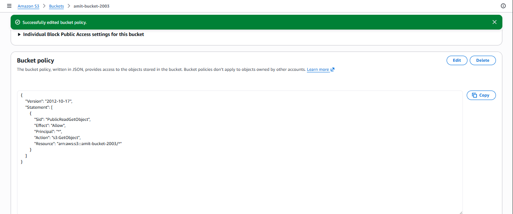


## File Uploaded in S3
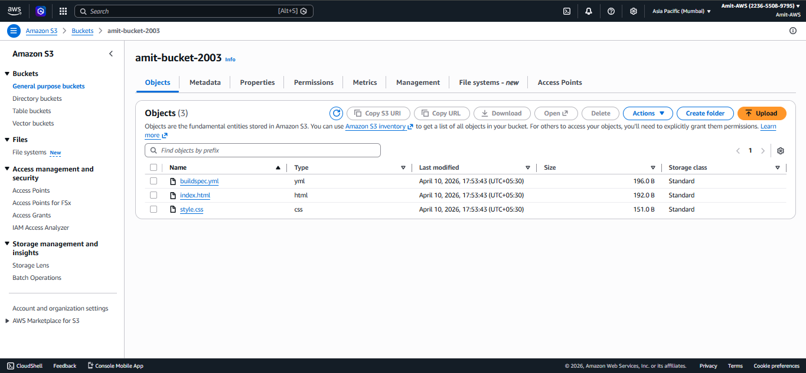


## Enable Static Website Hosting - S3
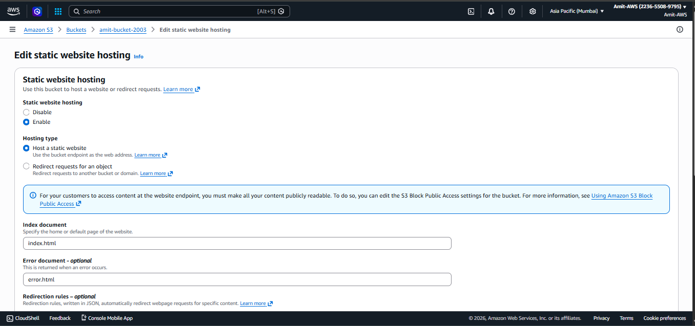


## Website Output
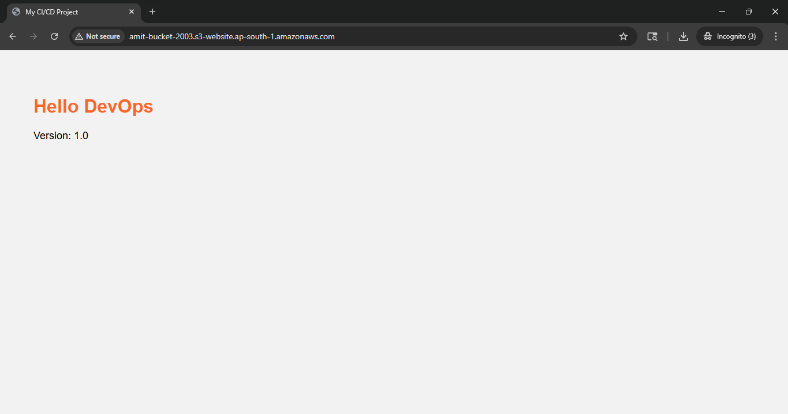


## Code Build Creation
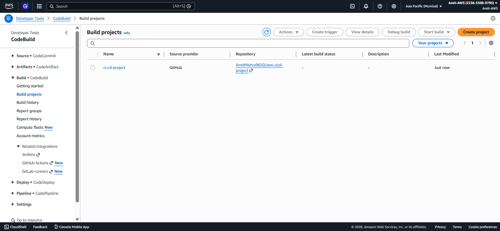


## Code Build Success
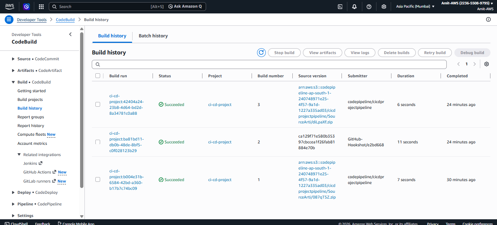


## Pipeline Success
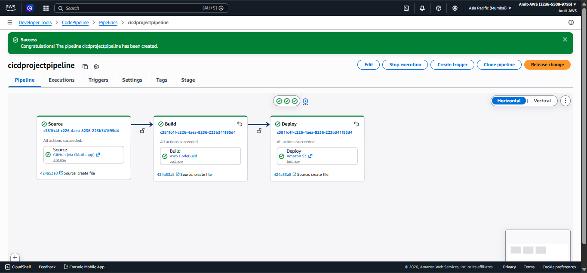


## Update index.html File in GitHub
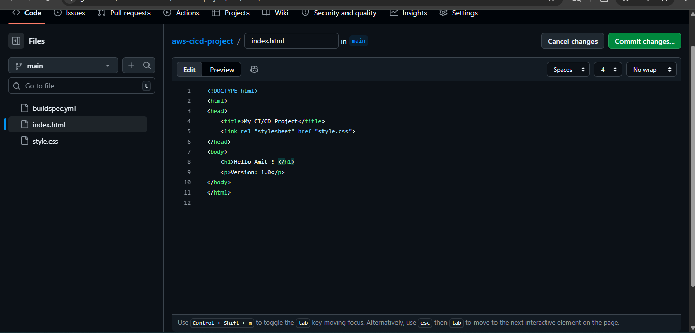


## Updated index.html Pipeline Success
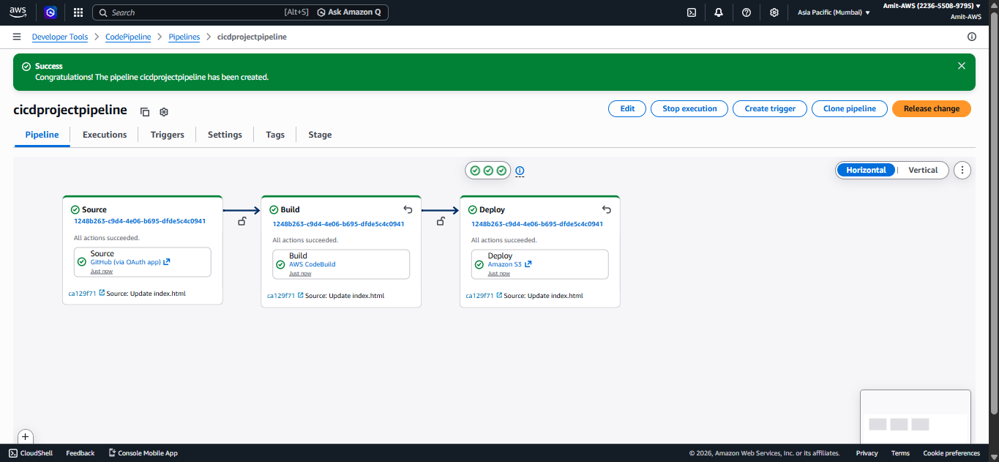


## Website Output After Updating index.html
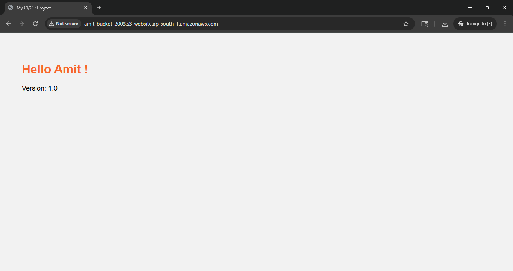


## Logs
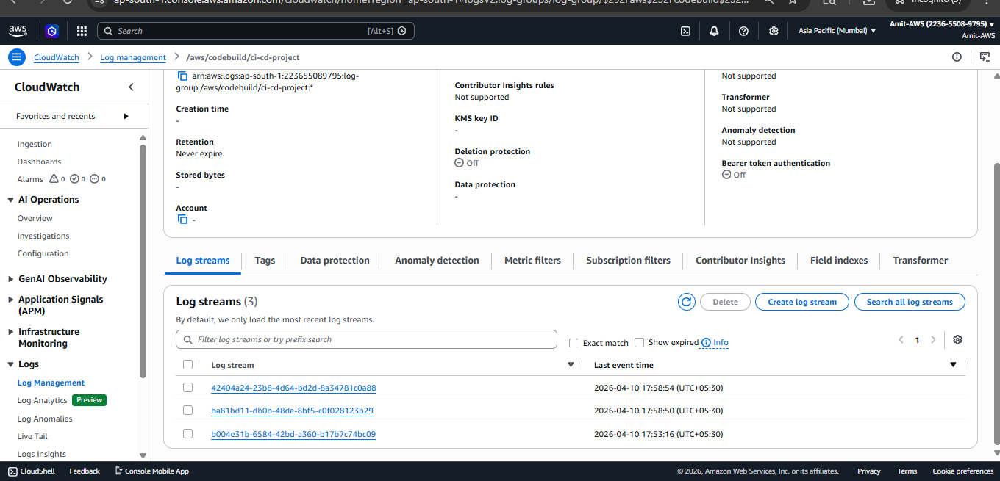


## 📂 Project Files

```
index.html
error.html
buildspec.yml
README.md
style.css


## 👨‍💻 Author

Amit Mishra 
